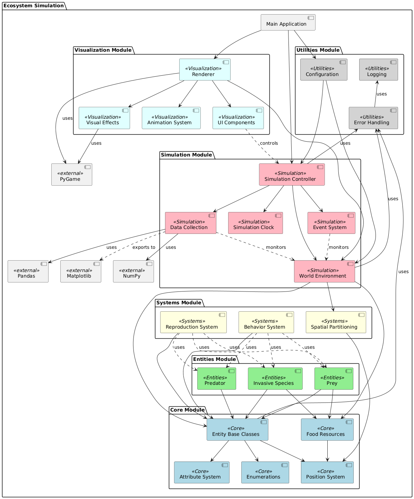

# Ecosystem Simulation: Predator-Prey Dynamics with Invasive Species Project

An agent-based simulation of the interactions between predator and prey populations, with a particular emphasis on how invasive species disrupt existing ecological relationships.

## Table of Contents
- [Team Members](#team-members)
- [Architecture](#architecture)
- [Environment](#environment)
- [Executing the Simulationn](#executing-the-web-application)
- [Controls and Interaction](#Controls-and-Interaction)
- [Acknowledgments](#Acknowledgments)

## Team Members
Nathan Onyechie

## Architecture
The application follows a modular architecture with clear separation of Logic and UI as stated by the rubric:



1. Core Module (/src/core)
   - Provides fundamental data structures and base classes
   - Contains the abstract Entity class, Position, and EntityAttributes classes
   - Implements FoodResource for physical resource representation
   - Defines enumerations like Gender and SeasonType
   - No dependencies on other modules – everything depends on this

2. Entity Module (/src/entities)
   - Implements concrete entity types: Predator, Prey, and InvasiveSpecies
   - Each entity has specialized behaviors and attributes
   - Depends only on the Core module
   - Can be extended with new entity types without modifying existing code

3. Systems Module (/src/systems)
   - Contains cross-cutting functional components
   - Implements BehaviorSystem for AI decision-making
   - Provides ReproductionSystem for entity reproduction
   - Contains SpatialPartitioning for efficient spatial queries
   - Depends on Core module, used by Entities and World

4. Simulation Module (/src/simulation)
   - Manages the simulation environment and flow
   - World class acts as the central container and coordinator
   - Simulation class controls the main simulation loop
   - SimulationClock handles time progression and scaling
   - DataCollector gathers metrics and performs analysis
   - Integrates all other modules to create a functioning ecosystem

5. Visualization Module (/src/visualization)
   - Handles rendering and user interface
   - Renderer class visualizes the simulation state using PyGame
   - Provides controls for user interaction
   - Depends on the Simulation module but not the reverse
   - Can be disabled for headless operation

6. Utilities Module (/src/utils)
   - Contains helper functions and error handling
   - Implements custom exceptions hierarchy
   - Provides logging functionality
   - Used throughout all other modules

Data Flow
The simulation follows a unidirectional data flow:

User input → Visualization → Simulation
Simulation updates World state
World updates Entities and Resources
Entities make decisions via Behavior/Reproduction Systems
Entity states and interactions affect World state
DataCollector gathers metrics from World
Visualization renders current World state

Entity Behaviors
Each entity type has unique behaviors and characteristics:

Predators
   - Actively hunt prey with adaptive hunting success rates
   - Balance energy consumption between hunting and reproduction
   - Respond to prey population density for more effective control

Prey
   - Forage for physical food resources in the environment
   - Compete with other prey for limited resources
   - Flee from predators when detected
   - Reproduce based on energy levels and environmental carrying capacity

Invasive Species
   - Compete directly with native species for resources
   - More efficient at foraging than native prey
   - Adapt to the environment over time, becoming more effective
   - Aggressive resource competition behavior

Environmental System
The environment includes:
   - Food Resources: Physical entities that grow, can be depleted, and regenerate
   - Spatial Partitioning: Efficient entity proximity detection
   - Seasonal Changes: Affecting resource availability and behaviors
   - Population Controls: Natural balancing mechanisms through resource competition

## Environment
This is a python application that has been tested on Windows.

Prerequisites:
1. Python 3.8+
2. PyGame
3. NumPy
4. Pandas
5. Matplotlib

To set up your environment:
```bash
# Clone the repository
git clone https://github.com/wedbeeU2/Eco-Sim-Project.git

# Navigate to the project directory
cd Eco-Sim-Project

# Install dependencies
pip install -r requirements.txt
```

## Executing the Application
To build and run the application:

```bash
# Run with default settings
python main.py

# Run with custom settings
python main.py --predators 15 --prey 75 --width 1200 --height 900

# Run with invasive species from the start
python main.py --invasive 5

# Run in headless mode for data collection
python main.py --headless --duration 30
```

## Controls and Interaction
Keyboard Controls

Space: Pause/resume simulation
R: Reset simulation
I: Introduce invasive species
G: Toggle grid visibility
S: Toggle statistics detail
P: Take screenshot
T: Toggle entity tracking
Esc: Exit simulation

Mouse Controls

Click on entity: Select entity to view detailed information
Click on UI buttons: Activate corresponding functions
Drag sliders: Adjust simulation parameters

Visual Guide
Entity Representation

Red Diamonds: Predators
Green Diamonds: Prey
Purple Diamonds: Invasive species
Green Dots: Food resources

UI Elements

Population Statistics: Current counts of each species
Simulation Controls: Start/pause, reset, add invasive species, etc.
Time Information: Current simulation day and time
Seasonal Indicator: Current season affecting resource availability


Common Issues:
```
To be added
```

Sample output:
```
To be added
```
## Acknowledgments
This project was developed for CS 4632: Model Simulation (Spring 2025) at Kennesaw State University.